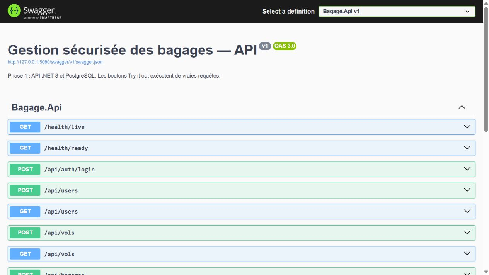
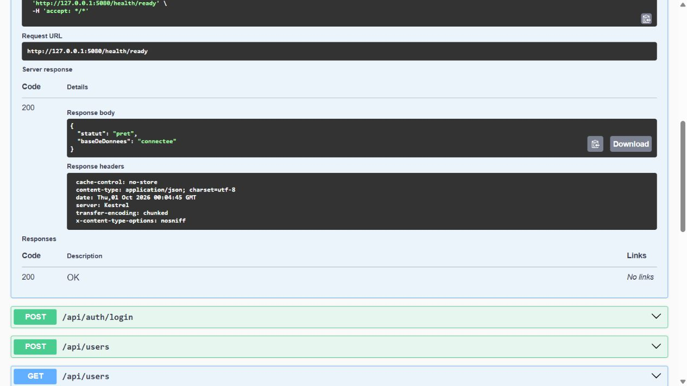
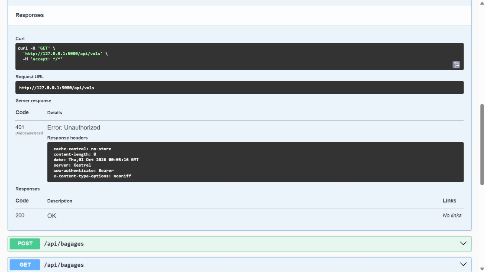
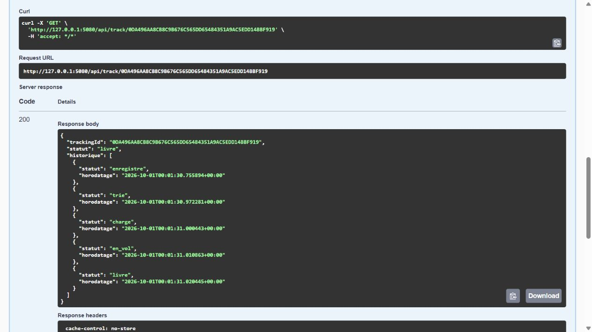

# Phase 1 — API et PostgreSQL

**Date : 1er octobre 2026.**
**Projet :** `C:\Users\User\Desktop\fullstack-bagage`.
**État :** backend validé en natif et Docker ; complément détaillé dans [01b-validation-docker.md](01b-validation-docker.md).

## 1. Objectif

Construire les fondations du système de gestion sécurisée des bagages : comptes
et rôles, vols, enregistrement, suivi public et traçabilité. Cette phase correspond
à la semaine 1 du cahier des charges. Elle ne valide pas encore le VPN.

## 2. Travail réalisé

- Solution `FullstackBagage.sln` et projet ASP.NET Core ciblant `net8.0`.
- Modèles, migration Entity Framework et export SQL `database/001_initial.sql`.
- Tables `roles`, `users`, `vols`, `bagages`, `historique_statuts`.
- Authentification JWT et hashage Identity ; aucun mot de passe stocké en clair
  dans les tables. Les secrets de développement restent dans un fichier privé
  distinct, exclu de Git.
- Verrouillage du compte pendant 15 minutes après cinq mots de passe incorrects.
- Limitation des connexions à 10 requêtes/minute/adresse IP et du suivi public
  à 60 requêtes/minute/adresse IP, dans cette instance de l'API.
- Enregistrement initial et changements de statut horodatés avec l'agent.
- Détection des transitions anormales, refus ou exception motivée du superviseur.
- Mise à jour atomique du statut et de l'historique, contrôle de concurrence.
- Compte PostgreSQL applicatif distinct du compte propriétaire.
- Dockerfile multi-stage, utilisateur non-root et configuration Compose locale.
- Swagger disponible uniquement en environnement Development.
- Tests reproductibles et captures d'appels réels.

## 3. Relations de données

```text
roles 1 ----- N users
vols  1 ----- N bagages
bagages 1 --- N historique_statuts
users   1 --- N historique_statuts
```

Un bagage appartient obligatoirement à un vol. Le nom du passager est conservé
dans la base privée et n'est pas présent dans la réponse publique. Les identifiants
internes sont des UUID ; le code de tracking est un secret aléatoire indépendant.
Les timestamps sont transmis en UTC par l'API.

Le statut est `enregistre -> trie -> charge -> en_vol -> livre`.
Le statut `perdu` est autorisé depuis tout autre statut. Les corrections hors
de ce parcours nécessitent un superviseur et un motif.

## 4. Routes et permissions

| Méthode et route | Autorisation |
|---|---|
| `GET /health/live` | Diagnostic local |
| `GET /health/ready` | Diagnostic de connexion PostgreSQL |
| `POST /api/auth/login` | Connexion, limitée en débit |
| `GET /api/track/{trackingId}` | Public, données minimales |
| `POST /api/users` | Administrateur |
| `GET /api/users` | Administrateur |
| `POST /api/vols` | Superviseur |
| `GET /api/vols` | Agent authentifié |
| `POST /api/bagages` | AgentEnregistrement, Superviseur |
| `GET /api/bagages` | AgentTri, Superviseur |
| `PATCH /api/bagages/{id}/statut` | AgentTri, Superviseur |
| `GET /api/bagages/{id}/historique` | AgentEnregistrement, AgentTri, Superviseur |

L'administrateur système ne reçoit pas automatiquement les permissions métier.
La modification des comptes/rôles et la désactivation par interface restent à
ajouter ; cette phase fournit leur création et leur liste. L'API vérifie aussi
l'état actif et le rôle actuel en base lors de la validation de chaque JWT.

La liste de bagages accepte `volId`, `statut` et `page` (50 résultats/page).
La liste des vols et des comptes est limitée à 100 résultats dans cette version.

## 5. Démarrage local reproductible

Prérequis observés sur ce poste : SDK .NET 9.0.306 capable de compiler la cible
.NET 8, runtime ASP.NET Core 8.0.21, PostgreSQL 16.4 et PowerShell 7.
Les numéros ci-dessus décrivent le poste ; ils ne prétendent pas être les dernières
versions disponibles. Actualiser les runtimes avant un déploiement réel.

Dans PowerShell 7 :

```powershell
Set-Location 'C:\Users\User\Desktop\fullstack-bagage'
dotnet tool restore
./scripts/Initialize-Local.ps1
./scripts/Start-Local.ps1 -Documentation
```

Le script d'initialisation crée seulement les éléments absents, applique les
migrations, configure les droits et crée le premier administrateur si nécessaire.
Il utilise les exécutables PostgreSQL déjà installés. Pour un autre emplacement,
passer `-PgBin 'chemin\vers\bin'`.

- API : `http://127.0.0.1:5080`.
- Swagger réel : `http://127.0.0.1:5080/swagger/index.html`.
- Base dédiée : `127.0.0.1:55432`, nom `bagage`.
- Fichiers de la base : `work/pgdata`.
- Secrets locaux : `work/local-secrets.json`, permissions restreintes au compte
  Windows courant. Ne jamais capturer ni partager ce fichier.

Sans `-Documentation`, l'API démarre en environnement Production et Swagger
n'est pas exposé. Cette option ne met pas à elle seule le projet en production.

Le compte initial est `admin.local`, avec un mot de passe aléatoire dans le
fichier de secrets. Les scripts de test le lisent directement sans l'afficher.
Aucune inscription publique ni compte à mot de passe par défaut n'est créé.

Dans une deuxième fenêtre :

```powershell
./scripts/Test-Phase01.ps1
```

Après au moins une minute, pour éviter la limite de connexion partagée :

```powershell
./scripts/Test-Security.ps1
```

Ces tests créent des comptes, des vols et des bagages **fictifs** dans la base
locale et les conservent comme démonstration. Chaque exécution utilise des noms
distincts. Ne pas utiliser ces scripts sur une base de production.

Arrêt sans suppression de données :

```powershell
./scripts/Stop-Local.ps1
```

## 6. Résultats effectivement observés

| Vérification | Résultat |
|---|---|
| Compilation .NET | Réussie, 0 erreur, 0 avertissement |
| Tests HTTP fonctionnels | 36/36 réussis |
| Tests verrouillage et débit | 9/9 réussis |
| PostgreSQL réel | Connexion et migrations réussies |
| Compte applicatif | Non-superutilisateur, sans création de rôles/base/tables |
| Historique | Lecture et ajout autorisés ; modification/suppression interdites au rôle applicatif |
| Écoute réseau native | API et base limitées à 127.0.0.1 |
| Redémarrage PostgreSQL et initialisation répétée | Réussis ; données conservées, diagnostic HTTP 200 |
| Audit NuGet | Aucun package signalé vulnérable par les sources interrogées |
| Docker Compose | Analyse de configuration réussie |
| Conteneurs Docker | Validés après réparation : 39 tests métier, 9 sécurité, 14 infrastructure et 2 persistance réussis |
| VPN, HTTPS, accès hors VPN | Non implémentés, non testés |

Preuves : `../preuves/phase-01-tests.txt`, `phase-01-securite.txt`,
`phase-01-postgresql.txt`, `phase-01-compilation.txt`,
`phase-01-dependances.txt`, `phase-01-ecoute-reseau.txt`.

L'audit des dépendances n'est pas un audit complet de sécurité. La protection
contre les mises à jour concurrentes a été vérifiée sous Docker (réponses 200/409 et historique sans doublon). Un test de charge reste à effectuer. Le contrôle du format Identity en SQL est une
vérification complémentaire ; le hashage provient de PasswordHasher dans le code.

## 7. Captures réelles pour le rapport

Les fichiers suivants sont des captures JPEG du navigateur affichant Swagger
connecté à l'API locale. Les boutons Execute ont produit de véritables requêtes
vers PostgreSQL. Aucune page de faux terminal, aucun résultat recréé et aucun
fichier HTML servant de capture n'ont été utilisés.

### Figure 1 — API disponible



**Légende proposée :** « Documentation interactive des routes du backend
ASP.NET Core du système de gestion des bagages. »

### Figure 2 — Connexion PostgreSQL



**Légende proposée :** « L'appel GET /health/ready retourne HTTP 200 et confirme
la connexion de l'API à l'instance PostgreSQL de développement. »

### Figure 3 — Authentification obligatoire



**Légende proposée :** « Une requête GET /api/vols sans JWT est refusée par
l'API avec HTTP 401. Cette vérification démontre le contrôle applicatif ;
elle ne démontre pas encore un filtrage VPN. »

### Figure 4 — Suivi public sans données personnelles



**Légende proposée :** « Suivi public d'un bagage fictif livré : les cinq étapes
horodatées sont visibles sans exposer l'identité du passager ni les agents. »

Pour reproduire : ouvrir Swagger, développer la route, cliquer Try it out,
renseigner le code si nécessaire puis Execute. Le code fictif de cette capture
est conservé dans `../preuves/phase-01-capture-urls.json`. Utiliser ensuite
l'outil de capture réel du navigateur ou Windows et enregistrer une image.

Les empreintes SHA-256 sont dans `../captures/phase-01/manifest.json`.
Elles permettent de vérifier qu'un fichier n'a pas changé depuis l'archivage ;
elles ne constituent pas à elles seules une certification d'authenticité.

## 8. Environnement Docker validé

Arrêter d'abord l'API native pour libérer le port 5080, puis, avec un moteur
Docker fonctionnel et en mode conteneurs Linux :

```powershell
./scripts/Stop-Local.ps1
./scripts/Initialize-Docker.ps1
docker compose ps
Invoke-RestMethod http://127.0.0.1:18080/health/ready
```

Le script génère `.env` uniquement s'il est absent, initialise le rôle
`bagage_app`, applique les migrations puis les permissions et crée le premier
administrateur. Les identifiants Docker sont distincts de ceux de l'instance
native. Les tests acceptent `-Environment Docker -BaseUrl http://127.0.0.1:18080`. Le port Docker configurable par `API_PORT` vaut 18080 par défaut, car Windows réserve actuellement 5080. Voir le guide 01b.

La base Docker n'a pas de port publié. L'API est liée à la boucle locale de
l'hôte, s'exécute sans root, avec un système de fichiers en lecture seule et
un répertoire `/tmp` temporaire. Les volumes Docker et la base native sont séparés.
Le frontend sera ajouté à Compose dans la phase 2.

Ne pas utiliser `docker compose down -v` sur des données à conserver.
Les clés et mots de passe de démonstration dans `.env.example` doivent être
remplacés ; le script génère des valeurs aléatoires pour un nouveau `.env`.

## 9. Limites et suite

La phase 1 est clôturée : API native et Docker validés.
Les migrations utilisent le compte propriétaire ; l'API utilise le compte limité.
Le propriétaire PostgreSQL peut encore altérer les données : l'historique n'est
pas un stockage inviolable face à ce propriétaire.

HTTP local est utilisé pour la démonstration. TLS, le proxy public limité au
tracking, WireGuard, les règles firewall et les tests avec JWT hors VPN restent
à réaliser. Les compteurs de débit sont en mémoire et devront être adaptés à
plusieurs instances. Prévoir également sauvegardes, supervision, politique de
rétention des données personnelles et procédure de récupération des comptes.

**Étape suivante :** créer les deux interfaces Angular et
leur intégration, avec un guide `02-frontend.md` et des captures réelles dédiées.

## Références techniques

- [ASP.NET Core : authentification JWT](https://learn.microsoft.com/aspnet/core/security/authentication/configure-jwt-bearer-authentication?view=aspnetcore-8.0)
- [Npgsql : fournisseur EF Core](https://www.npgsql.org/efcore/)
- [EF Core : gestion de la concurrence](https://learn.microsoft.com/ef/core/saving/concurrency)
- [PostgreSQL : privilèges](https://www.postgresql.org/docs/16/ddl-priv.html)


