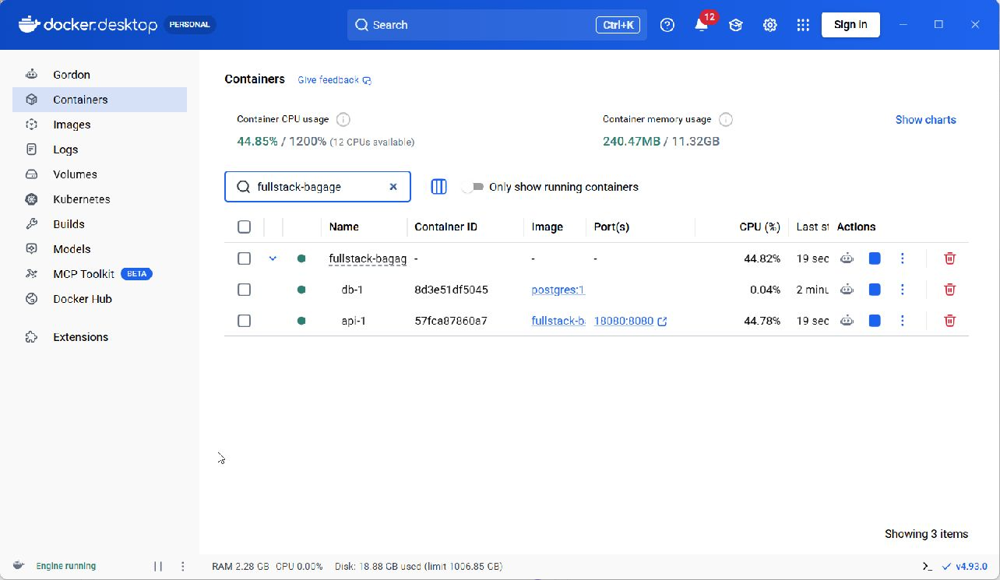
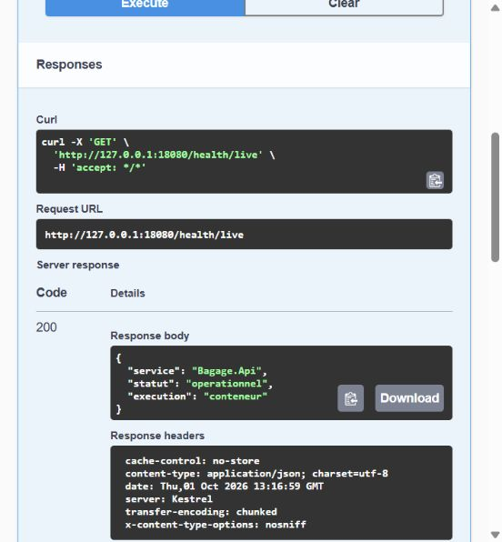
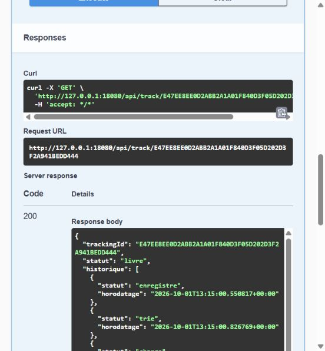

# Phase 1 — Réparation et validation Docker

**Date : 1er octobre 2026.**
**Dossier :** `C:\Users\User\Desktop\fullstack-bagage`.

## Diagnostic et correction

La version installée était Docker Desktop 4.24.1, avec Docker Engine 24.0.6.
WSL 2 était déjà installé (2.7.8.0). Le démarrage atteignait WSL mais le journal
du moteur indiquait `dockerd failed to start`. La configuration du daemon
passait son contrôle `--validate` ; le problème précédait donc les conteneurs
du projet. La cause interne exacte de cet ancien moteur n'a pas été établie.

La mise à jour officielle vers Docker Desktop 4.93.0 a été effectuée. Le premier
téléchargement par winget ayant été interrompu, l'installateur a été téléchargé
directement depuis le domaine officiel `desktop.docker.com`. Son SHA-256 a été
comparé à celui du catalogue winget et sa signature Authenticode, émise à
Docker Inc, a été vérifiée comme valide.

```text
SHA256 : C139124C9CF71477DC565C3C0EA5A18F90B93D68EBE9AAA848A065960416C0BC
Docker Desktop : 4.93.0.240920
Docker Engine : 29.8.1
Contexte : desktop-linux
```

Après le démarrage initial et la préparation du stockage, le moteur a répondu
à `docker --context desktop-linux version`. Les conteneurs préexistants sont
restés présents. Aucune réinitialisation d'usine, suppression de volume ou
désinscription de distribution WSL n'a été effectuée.

La configuration antérieure de Docker est sauvegardée dans
`work/docker-repair/settings-before.json`. Ce fichier est privé et exclu du
rapport ainsi que du contexte de construction Docker.

## Modifications du projet

- Utilisation explicite du contexte `desktop-linux` dans les scripts Docker.
- Attente du statut sain de PostgreSQL avant les migrations.
- Sonde de santé de l'API, exécutée par `dotnet Bagage.Api.dll --healthcheck`.
- Tests fonctionnels et de sécurité paramétrables avec `-Environment Docker`.
- Preuves Docker séparées des preuves natives.
- Test du durcissement et des permissions : `scripts/Test-Docker.ps1`.
- Test de persistance : `scripts/Test-DockerPersistence.ps1`.
- Fichier Compose de documentation locale pour capturer Swagger réellement
  exécuté dans le conteneur. La configuration principale reste en Production.
- Convention LF pour les scripts shell d'initialisation PostgreSQL.

## Commandes de reproduction

Dans PowerShell 7, avec Docker Desktop démarré en mode Linux :

```powershell
Set-Location 'C:\Users\User\Desktop\fullstack-bagage'
docker --context desktop-linux version
./scripts/Stop-Local.ps1
./scripts/Initialize-Docker.ps1
./scripts/Test-Docker.ps1
./scripts/Test-Phase01.ps1 -Environment Docker -BaseUrl http://127.0.0.1:18080
```

Attendre au moins 60 secondes après les tests fonctionnels, car la limite de
connexion s'applique aussi aux tests, puis lancer :

```powershell
./scripts/Test-Security.ps1 -Environment Docker -BaseUrl http://127.0.0.1:18080
./scripts/Test-DockerPersistence.ps1
```

Les tests créent uniquement des données fictives dans la base Docker de ce
projet. Les identifiants sont lus depuis `.env` sans être affichés. Ne jamais
publier `.env`, un JWT ou la sortie complète de `docker inspect` contenant les
variables d'environnement.

Les données sont dans le volume nommé `fullstack-bagage_postgres_data`.
Pour arrêter le projet en les conservant :

```powershell
docker --context desktop-linux compose stop
```

## Captures réelles

La capture Docker Desktop doit montrer la pile `fullstack-bagage` et ses deux
services démarrés. Les captures Swagger doivent provenir du service conteneurisé.
Pour ouvrir temporairement la documentation locale :

```powershell
docker --context desktop-linux compose -f docker-compose.yml -f docker-compose.documentation.yml up -d --wait api
```

Ouvrir `http://127.0.0.1:18080/swagger/index.html`, exécuter les appels puis
capturer l'application réelle. Après les captures :

```powershell
docker --context desktop-linux compose up -d --wait api
./scripts/Test-Docker.ps1
```

La remise en Production doit rendre `/swagger/index.html` inaccessible (404).

## Résultats

La phase 1 est validée sous Docker le 1er octobre 2026.

| Vérification | Résultat observé |
|---|---|
| Tests fonctionnels, rôles, historique, suivi et concurrence | 39/39 réussis |
| Verrouillage des comptes et limitation des connexions | 9/9 réussis |
| Infrastructure, santé, réseau et permissions | 14/14 réussis |
| Persistance après arrêt et redémarrage | 2/2 réussis ; 8 bagages et 22 événements conservés |
| Deux modifications simultanées | Une réponse 200 et une 409 ; aucun doublon d'historique |
| Configuration finale | Production, Swagger 404, API et PostgreSQL healthy |

Les preuves brutes sont dans `../preuves/phase-01-docker-*`. Les tests natifs
historiques comptaient 36 vérifications ; les 3 contrôles de concurrence ont
été ajoutés et exécutés sous Docker. Un test de charge reste à réaliser.

### Correction complémentaire du port Windows

Au redémarrage, Windows réservait la plage TCP 5041–5140, contenant 5080.
Docker répondait alors `ports are not available`, malgré un moteur sain.
Voir `../preuves/phase-01-ports-reserves-windows.txt`.
Compose publie maintenant `127.0.0.1:${API_PORT:-18080}:8080` : le défaut 18080
a été validé. Pour le modifier, définir `API_PORT` dans `.env` et transmettre
l'URL correspondante aux tests avec `-BaseUrl`.
Aucune exclusion de ports Windows ni protection système n'a été supprimée.
Les anciennes captures sur 5080 restent des preuves historiques du mode natif.

### Figures pour le rapport



**Figure 5.** Docker Desktop 4.93.0 : PostgreSQL et API démarrés, port 18080.
Reproduction : Containers, rechercher `fullstack-bagage`, développer la pile.
Les sondes healthy sont vérifiées dans les preuves CLI.



**Figure 6.** Appel réel `GET /health/live` dans Swagger temporairement activé :
HTTP 200 et `execution: conteneur`. Reproduction : Try it out, puis Execute.



**Figure 7.** Suivi réel du bagage fictif après redémarrage : statut livré et
début de l'historique. Les cinq étapes intégrales sont dans la preuve JSON.
Reproduction : exécuter `GET /api/track/{trackingId}` avec le code de
`../preuves/phase-01-docker-capture-urls.json`.

Ces images sont des JPEG originaux, sans reconstruction HTML. Swagger a été
désactivé après les captures et les 14 contrôles Docker ont été rejoués avec
succès en Production. La prochaine phase porte sur Angular ; VPN, TLS et
Kubernetes restent à réaliser dans les phases suivantes.

## Références

- [Installation et mise à jour officielles de Docker Desktop sur Windows](https://docs.docker.com/desktop/setup/install/windows-install/)
- [Backend WSL 2 de Docker Desktop](https://docs.docker.com/desktop/features/wsl/)


