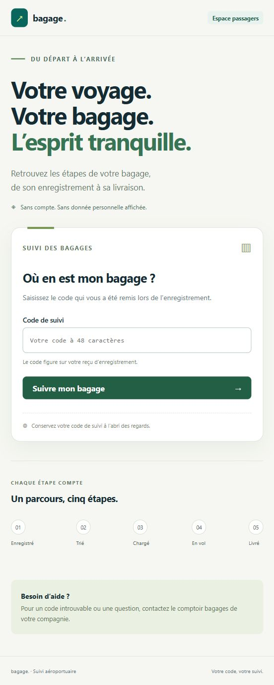
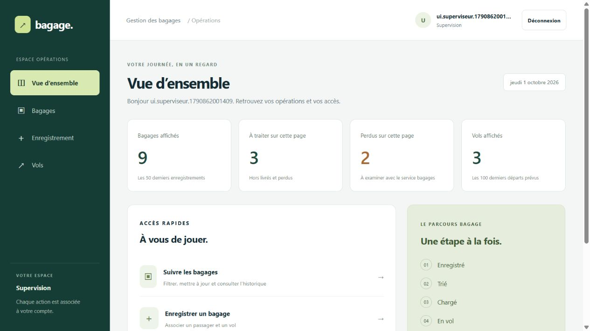
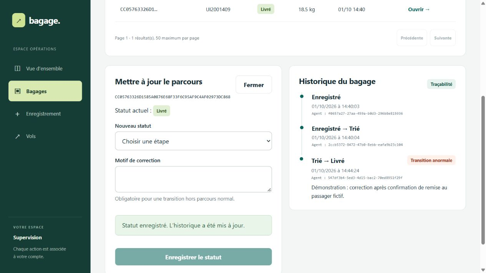
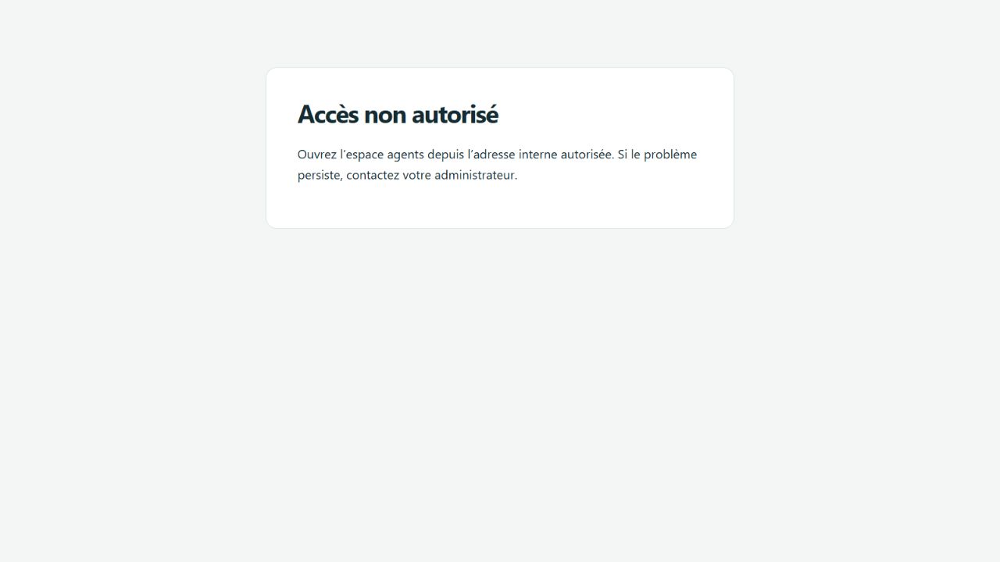

# Phase 2 — Interfaces Angular et intégration

**Projet :** `C:\Users\User\Desktop\fullstack-bagage`.
**Date :** 1er octobre 2026.
**État :** phase 2 validée en démonstration locale sous Docker.

## Objectif et choix

Livrer deux applications compilées séparément : un suivi passager sans compte,
et une console pour les agents, superviseurs et administrateurs. Elles utilisent
les données réelles de l'API .NET et de PostgreSQL ; les démonstrations utilisent
uniquement des comptes, vols et passagers fictifs.

Angular 22.2.1 est la version stable retournée par le registre npm lors de cette
phase ; Angular CLI/build 22.2.0 et TypeScript 6.0 sont verrouillés dans
`front/package-lock.json`. Le Node global 24.11.1 est trop ancien pour cette
version Angular. La compilation utilise l'image officielle `node:24-alpine`,
avec une version compatible, sans modifier l'installation Node de Windows.

## Fonctionnalités

| Espace / rôle | Actions proposées |
|---|---|
| Passager | Code de suivi, statut actuel, historique, erreurs de saisie ou de connexion |
| Agent d'enregistrement | Liste des vols, enregistrement, reçu de suivi, historique par référence interne |
| Agent de tri | Liste paginée et filtrée, étapes normales, déclaration perdu, historique |
| Superviseur | Vue bagages, enregistrement, création de vols, correction motivée, historique des anomalies |
| Administrateur | Liste et création des comptes avec choix du rôle ; aucune opération métier sur les bagages |

Les indicateurs du tableau de bord sont calculés à partir des données réellement
chargées. Ils indiquent explicitement leurs limites : 50 bagages, 100 vols ou
100 comptes. Ils ne sont pas présentés comme des totaux globaux.

Les horodatages UTC de l'API sont affichés dans le fuseau du navigateur.
Les formulaires signalent les erreurs HTTP 401, 403, 404, 409 et 429.
Les mises à jour de statut rechargent la liste et l'historique.

## Fichiers principaux

- `front/angular.json`, `package.json`, `package-lock.json` : espace Angular et dépendances.
- `front/public/src` : formulaire et résultat de suivi.
- `front/agents/src/auth.ts` : session en mémoire, expiration, intercepteur, gardes.
- `front/agents/src/main.ts` : vérification d'origine avant import de l'espace agents.
- `front/agents/src/shell.ts` : connexion, navigation et tableau de bord.
- `front/agents/src/bags.ts`, `forms.ts`, `history.ts` : opérations métier.
- `front/shared` : contrats de données, libellés et styles.
- `front/public/Dockerfile`, `front/agents/Dockerfile` : compilation et service Nginx non-root.
- `front/public/nginx.conf`, `front/agents/nginx.conf` : règles de proxy et en-têtes.
- `scripts/Start-Phase02.ps1`, `scripts/Test-Phase02.ps1` : démarrage et contrôles reproductibles.

## Séparation des accès

Le frontend public ne relaie que `GET /api/track/{code}` avec un code hexadécimal
de 48 caractères. Le proxy bloque les autres routes API même si une requête
contient un JWT valide, et retire l'en-tête Authorization du suivi public.
Les journaux d'accès de cette route sont désactivés pour ne pas conserver les codes.

Le frontend agents n'accepte que les hôtes locaux prévus dans Nginx. Avant le
chargement de son module, il vérifie l'origine exacte contre
`front/agents/public/segment.json`. Une configuration absente ou une origine
inattendue bloque le démarrage. Ce contrôle applicatif complète le réseau ;
il ne permet pas de détecter à lui seul si un client utilise un VPN.

Le JWT est conservé en mémoire, jamais dans localStorage ni sessionStorage.
Un rechargement de page exige donc une nouvelle connexion. La déconnexion,
l'expiration et un refus HTTP 401 suppriment la session. Les menus et gardes
Angular limitent les actions visibles ; l'API reste l'autorité pour les droits.

Les trois points d'entrée hôte sont liés à 127.0.0.1 : public 14200, agents
14201, API 18080. PostgreSQL ne publie aucun port. Cette phase valide une
démonstration locale, pas encore un accès Internet/VPN. Aucun CORS permissif
n'est nécessaire : chaque interface appelle son proxy sur la même origine.

## Démarrer et reproduire

Dans PowerShell 7, avec Docker Desktop en mode Linux :

```powershell
Set-Location 'C:\Users\User\Desktop\fullstack-bagage'
# Si la phase 1 n'a jamais été initialisée :
./scripts/Initialize-Docker.ps1
./scripts/Start-Phase02.ps1
./scripts/Test-Phase02.ps1
```

Ouvrir :

- Passagers : `http://127.0.0.1:14200`.
- Agents : `http://127.0.0.1:14201`.

Le test crée quatre comptes de démonstration et un parcours fictif. Les
identifiants aléatoires sont dans `work/phase-02-demo-secrets.json`, privé,
ignoré par Git et exclu du rapport. Le compte initial de phase 1 reste utilisable.
Ne pas publier ce fichier ni `.env`, et ne pas photographier de mots de passe.
Le code public fictif est conservé dans `docs/preuves/phase-02-demo.json`.
Espacer deux exécutions du test d'au moins une minute pour respecter le débit
de connexion de l'API. Les comptes de test restent en base pour la démonstration.

Pour arrêter sans supprimer les données :

```powershell
docker --context desktop-linux compose stop
```

Pour reprendre sans reconstruire :

```powershell
docker --context desktop-linux compose up -d --wait db api public agents
```

## Résultats observés

| Vérification | Résultat |
|---|---|
| Compilation Angular Production | Deux applications compilées, sans erreur |
| Tests d'intégration HTTP / proxys / rôles | 33 contrôles réussis |
| Parcours réels dans le navigateur | 21 vérifications réussies |
| Conteneurs API, PostgreSQL, public et agents | Tous healthy |
| Audit npm des dépendances de production | 0 vulnérabilité signalée par le registre interrogé |
| Adaptation de l'interface | Rendus observés en largeur 552 px et 1280 px ; tableaux défilables |

Les preuves sont `phase-02-compilation.txt`, `phase-02-integration.json/.txt`,
`phase-02-navigateur.json/.txt`, `phase-02-conteneurs.txt` et
`phase-02-audit-runtime.json`, dans `docs/preuves`. Les contrôles HTTP sont
automatisés ; les 21 vérifications navigateur consignent les manipulations
réellement effectuées et observées, sans prétendre être une suite automatisée E2E.

Parcours intégral réalisé dans Angular : le superviseur crée le vol
`UI62281279`, l'agent d'enregistrement crée un bagage fictif de 22,4 kg,
l'agent de tri le passe à Trié et le passager retrouve les deux étapes dans
le suivi public. Un autre bagage sert à tester une correction Trié → Livré
avec motif, correctement marquée comme anomalie. L'administrateur crée un
compte depuis le formulaire. Les identifiants de ces exemples sont dans
`phase-02-navigateur.json` ; aucun mot de passe ou JWT n'y est enregistré.

Deux défauts ont été corrigés pendant la validation :

- L'optimisation des styles critiques produisait un chargement incompatible
  avec la CSP stricte sur les scripts. `inlineCritical: false` permet de
  charger la feuille externe sans affaiblir la règle `script-src 'self'`.
- La console lisait le rôle après effacement de la session. Son rendu est
  maintenant conditionné par la présence d'une session ; la déconnexion et
  le rechargement ont été retestés et renvoient à la connexion.

Le contrôle de l'origine a aussi été testé avec `http://localhost.:14201` :
Nginx reconnaît l'hôte local, mais l'origine exacte ne figure pas dans la
liste applicative. Le module agents n'est pas chargé et un refus s'affiche.
Ce résultat vérifie le contrôle applicatif, pas le VPN.

## Captures pour le rapport

Les neuf images ci-dessous sont des captures JPEG originales du navigateur
affichant les applications Angular réellement reliées à PostgreSQL. Aucun
résultat n'est reconstruit en HTML. Le manifeste contient les tailles et SHA-256.

| Figure | Fichier | Manipulation reproductible et légende |
|---|---|---|
| 1 | `01-accueil-public.jpg` | Ouvrir le port 14200 ; accueil public, capture de page complète en largeur étroite |
| 2 | `02-suivi-public.jpg` | Saisir le code de `phase-02-demo.json` puis Suivre ; état Trié observé avant la correction du superviseur |
| 3 | `03-connexion-agents.jpg` | Ouvrir `/bagages` sans session ; redirection vers le formulaire de connexion, champs vides |
| 4 | `04-dashboard-superviseur.jpg` | Se connecter comme superviseur ; indicateurs réels, accès métier, aucun menu comptes |
| 5 | `05-anomalie-historique.jpg` | Bagages, filtrer le vol UI2001409, Ouvrir, corriger vers Livré avec motif ; anomalie et agent conservés |
| 6 | `06-enregistrement-recu.jpg` | Avec AgentEnregistrement, sélectionner le vol et enregistrer un passager fictif ; reçu et code de suivi |
| 7 | `07-role-tri.jpg` | Avec AgentTri, ouvrir ce bagage et passer à Trié ; confirmation et historique |
| 8 | `08-creation-compte.jpg` | Avec Administrateur, créer un compte ; confirmation, formulaire réinitialisé sans mot de passe visible |
| 9 | `09-origine-refusee.jpg` | Ouvrir localhost.:14201 ; refus du contrôle applicatif d'origine |

Les captures sont historiques : le premier bagage est devenu Livré après la
figure 2. Le code du second parcours créé par les formulaires est dans
`phase-02-navigateur.json`. Les données peuvent évoluer après les captures.









## Limites et prochaine phase

- Pas encore de WireGuard, TLS ni règle firewall prouvant un refus hors VPN.
- Le paramétrage d'origine et les hôtes Nginx devront adopter l'adresse interne VPN à la phase 3.
- La gestion des comptes fournit création et liste ; changement de rôle, désactivation, récupération et rotation de mot de passe restent à ajouter à l'API.
- Pas de rafraîchissement automatique ou de renouvellement JWT ; recharger la page déconnecte volontairement l'agent.
- Les compteurs de débit de l'API voient l'adresse du proxy : ils sont partagés entre ses utilisateurs dans cette version. Adapter les proxys de confiance à la phase réseau, sans accepter aveuglément X-Forwarded-For.
- Pagination des vols/comptes, statistiques globales, sauvegardes et haute disponibilité restent des améliorations distinctes.

La phase suivante porte sur WireGuard, la segmentation réseau, le proxy public
HTTPS et les preuves d'accès autorisé/refusé depuis les réseaux appropriés.

## Références

- [Compatibilité Angular / Node / TypeScript](https://angular.dev/reference/versions)
- [Documentation Angular : gardes de routes](https://angular.dev/guide/routing/route-guards)
- [Image Nginx sans privilèges](https://github.com/nginx/docker-nginx-unprivileged)
