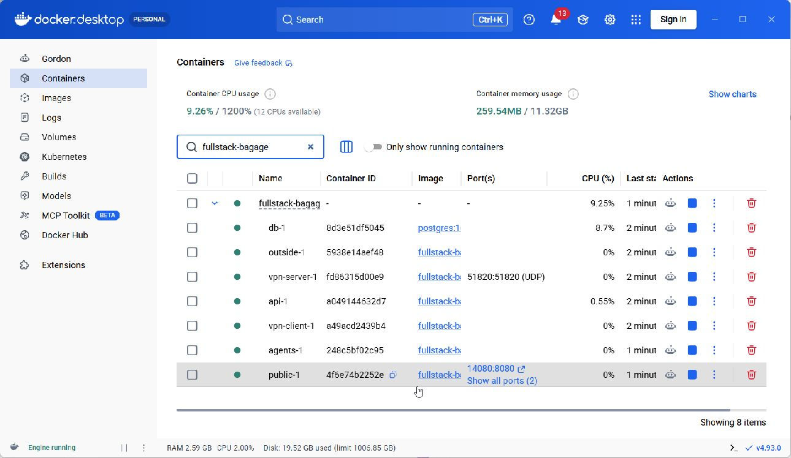
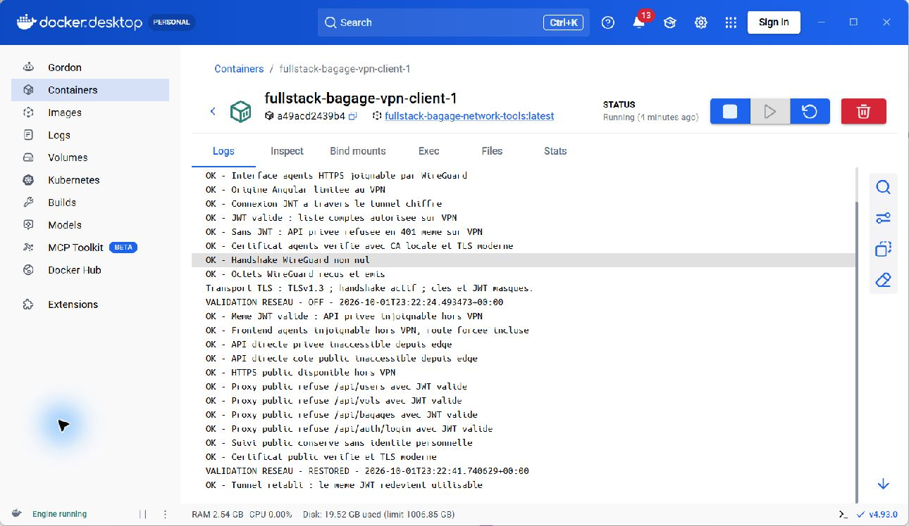
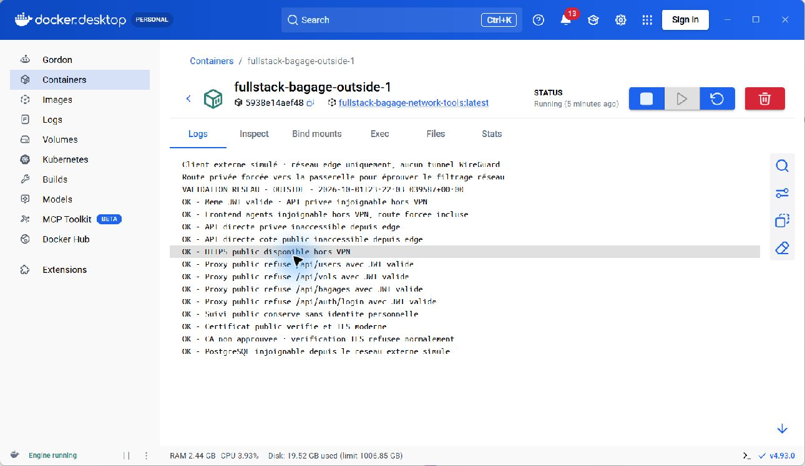

# Phase 3 — WireGuard, segmentation et HTTPS

Date : 2 octobre 2026 (Africa/Lagos). Les preuves techniques sont horodatées en UTC, le 1er octobre à 23 h.

## Objectif et état

Phase validée **dans le laboratoire Docker local** : 40 contrôles réussis. Un JWT valide permet l’accès privé avec le tunnel, échoue au niveau réseau après sa coupure, puis fonctionne après rétablissement. Le suivi passager reste accessible en HTTPS hors tunnel.

Ce résultat ne constitue pas un test depuis Internet ni une validation du client VPN natif Windows. Les trois captures sont de véritables fenêtres Docker Desktop, sans retouche ni page HTML simulée.

## Architecture réalisée

```text
Client externe simulé ── HTTPS ── Nginx public ── réseau public_api ── API
                               /api/track/* seulement                │
Client VPN ── WireGuard UDP ── Nginx agents ── réseau private_api ──────┤
                                                                    │
                                                       réseau database ── PostgreSQL
```

| Élément | Adresse / restriction |
|---|---|
| Réseau edge | 172.26.41.0/24 ; clients de test, entrée VPN et proxy public |
| Réseau private_api | 172.26.42.0/24, Docker internal ; passerelle VPN et API |
| Réseau public_api | 172.26.43.0/24, Docker internal ; proxy public et API |
| Tunnel | Serveur 10.77.0.1 ; client de validation 10.77.0.2 |
| HTTPS agents | https://10.77.0.1:8443 ; écoute uniquement sur l’adresse WireGuard |
| HTTPS public sur Windows | https://localhost:14443 |
| HTTP public sur Windows | http://127.0.0.1:14080 ; redirection 308 vers HTTPS |
| Entrée WireGuard sur Windows | 127.0.0.1:51820/UDP ; démonstration locale uniquement |
| API, agents et PostgreSQL | Aucun port publié sur Windows |

Le proxy agents partage l’espace réseau du serveur VPN. Le firewall de cet espace applique INPUT DROP et FORWARD DROP ; il accepte le trafic établi, loopback, WireGuard UDP et HTTPS provenant de wg0. Le routage IP est désactivé : le proxy relaie les requêtes vers l’API. Le client extérieur possède volontairement une route vers l’adresse privée, afin que le refus ne repose pas seulement sur une route absente.

Le proxy public ne transmet que les requêtes GET de suivi conformes au format du code. Les routes de connexion, utilisateurs, vols et bagages y renvoient 404 même avec un JWT valide. Les rôles et JWT demeurent contrôlés par l’API ; le VPN ne les remplace pas.

## Fichiers

- `docker-compose.secure.yml` : surcharge des ports, réseaux et services WireGuard.
- `infra/network/Dockerfile` : outils réseau, Python, curl et OpenSSL.
- `infra/network/init-secrets.sh` : clés WireGuard, autorité locale et certificats.
- `infra/network/server.sh`, `client.sh`, `client-up.sh`, `outside.sh` : réseau et firewall.
- `infra/network/public-tls.conf`, `agents-tls.conf` : reverse proxies HTTPS.
- `infra/network/segment-vpn.json` : origine autorisée pour l’interface agents.
- `infra/network/probe.py` : contrôles réseau/TLS réels et résultats expurgés.
- `scripts/Start-Phase03.ps1`, `scripts/Test-Phase03.ps1` : exécution reproductible.

Les fichiers privés restent dans `work/phase-03`, ignoré par Git et protégé par une ACL Windows : clés, configurations WireGuard, identifiants de test et échange temporaire du JWT. Ne jamais joindre ce dossier au rapport. Seul le certificat **public** de l’autorité est copié dans les preuves.

## Reproduire

Prérequis : phases 1 et 2 déjà initialisées, Docker Desktop Linux démarré, Compose >= 2.24.4 et support WireGuard du noyau WSL. Le volume PostgreSQL existant est conservé.

```powershell
Set-Location C:\Users\User\Desktop\fullstack-bagage
./scripts/Start-Phase03.ps1
./scripts/Test-Phase03.ps1

docker --context desktop-linux compose -f docker-compose.yml -f docker-compose.secure.yml --profile validation ps
```

Employer systématiquement **les deux fichiers Compose** pour cette phase. Les scripts historiques des phases 1 et 2 utilisent le mode HTTP local ; ne pas les lancer pour démarrer ou valider le mode sécurisé. Les anciennes adresses 18080, 14200 et 14201 sont fermées. L’ancien onglet Swagger 5080 n’est pas l’interface de cette phase.

Pour arrêter sans supprimer la base :

```powershell
docker --context desktop-linux compose -f docker-compose.yml -f docker-compose.secure.yml --profile validation stop
```

Le test coupe temporairement wg0 côté client de validation et le rétablit dans un bloc `finally`. Aucun tunnel ni firewall Windows n’est modifié.

## Résultats observés

| Groupe | Contrôles réussis | Preuves |
|---|---:|---|
| Tunnel actif, interface agents, origine, authentification, TLS et handshake | 8 | `phase-03-vpn.json` |
| Client extérieur sans tunnel, même JWT, proxy public limité, TLS, DB isolée | 13 | `phase-03-outside.json` |
| Coupure du tunnel et route forcée ; refus privé, suivi public conservé | 11 | `phase-03-off.json` |
| Tunnel rétabli ; le même JWT fonctionne de nouveau | 1 | `phase-03-restored.json` |
| API, agents et DB sans ports hôte | 3 | `phase-03-ports.txt` |
| Trois anciens ports fermés et redirection HTTP 308 | 4 | `phase-03-hote.txt` |
| **Total** | **40** | Fichiers dans `docs/preuves` |

Les clients Python vérifient la chaîne et le nom des certificats avec l’autorité locale explicitement fournie ; aucun contournement `-k` n’est utilisé. La négociation observée est TLS 1.3. Un client sans cette autorité refuse normalement le certificat. Les échecs réseau sont distingués des erreurs de certificat.

Le firewall et ses compteurs sont conservés dans `phase-03-firewall.txt` ; l’état des conteneurs dans `phase-03-conteneurs.txt`. Les contrôles valident des scénarios précis, pas une résistance à toute attaque.

## Captures réelles pour le rapport

Dans Docker Desktop, ouvrir Containers, filtrer `fullstack-bagage`, puis développer le projet. Les tests écrivent leurs résultats expurgés dans les journaux réels des conteneurs.

1. **Services et ports** : vue d’ensemble des sept conteneurs ; API, agents et DB sans publication de port.

   

2. **Tunnel actif, coupure et rétablissement** : ouvrir `vpn-client`, onglet Logs, après le test. Les résultats démontrent le changement d’accès avec le même JWT.

   

3. **Accès extérieur simulé** : ouvrir `outside`, onglet Logs. Le privé reste inaccessible et le suivi public fonctionne.

   

Les captures originales JPEG et leurs empreintes SHA-256 sont dans `docs/captures/phase-03/manifest.json`. Les fichiers texte et JSON permettent de lire les résultats complets si l’affichage du journal est tronqué.

## Limites et exploitation future

- Le client « extérieur » est un conteneur sur edge, pas une machine située sur Internet. Les ports hôte restent sur loopback. Un scan depuis une seconde machine et les règles du réseau de déploiement restent à valider en phase 4.
- Une configuration Windows privée est préparée dans `work/phase-03/wireguard/windows.conf`, mais aucun client VPN Windows n’a été installé ou activé. L’accès agents depuis le navigateur Windows n’est donc pas présenté comme validé.
- L’autorité de certification locale n’a pas été ajoutée au magasin de confiance Windows. Le navigateur peut afficher une alerte. Ne pas contourner l’alerte : utiliser une autorité approuvée pour le déploiement. Le test curl Windows avec cette CA a aussi rencontré une vérification de révocation Schannel indisponible, la CA de laboratoire n’ayant pas d’infrastructure de révocation. La validation TLS réussie rapportée concerne les clients Linux du laboratoire.
- Certificats serveur valables 90 jours et CA locale 365 jours ; prévoir renouvellement, distribution de confiance et révocation pour une exploitation réelle. Pas de HSTS configuré dans cette démonstration locale.
- Les composants réseau de laboratoire utilisent root avec la seule capacité supplémentaire NET_ADMIN ; les proxys et l’API conservent leur exécution non-root. Les clients de validation ont des montages de preuves et secrets réservés aux tests ; ils ne doivent pas devenir des services de production.
- Le proxy public peut joindre l’API sur son réseau dédié ; la restriction de routes repose sur sa configuration Nginx, complétée par l’autorisation de l’API.

## Prochaine étape

Phase 4 : manifests Kubernetes, services internes, NetworkPolicy avec un CNI qui les applique, déploiement sur un cluster de démonstration, vérification des accès et consolidation du rapport. Cette phase n’est pas encore réalisée.

## Références techniques

- [WireGuard — démarrage](https://www.wireguard.com/quickstart/)
- [WireGuard — espaces réseau](https://www.wireguard.com/netns/)
- [Docker Compose — fusion et remplacement des paramètres](https://docs.docker.com/reference/compose-file/merge/)
- [Nginx — configuration HTTPS](https://nginx.org/en/docs/http/configuring_https_servers.html)
