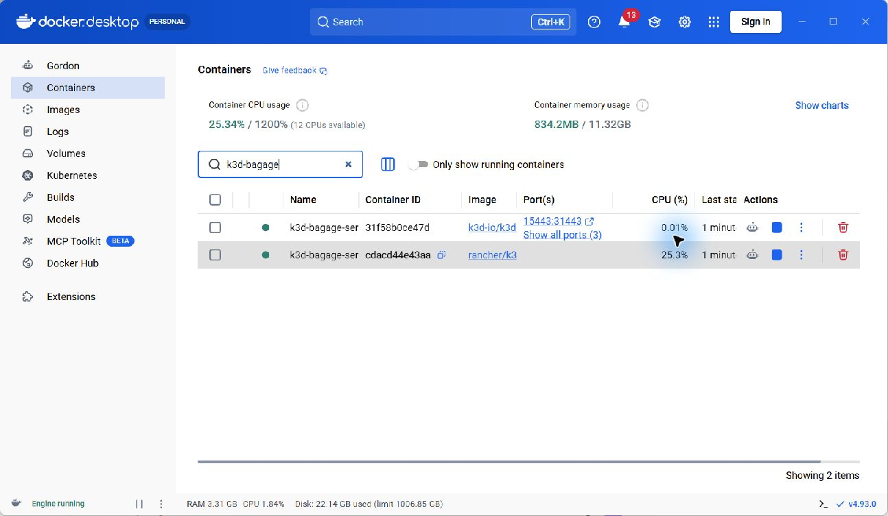
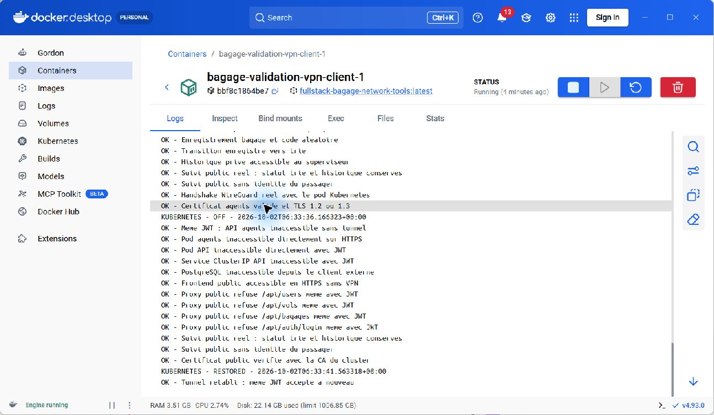
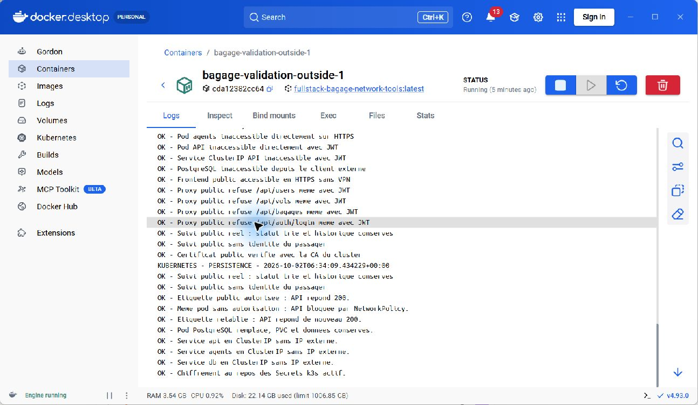
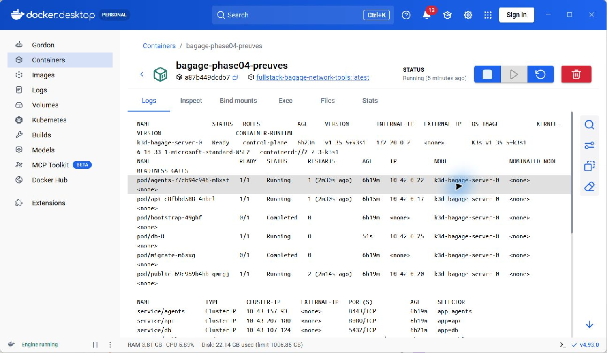

# Phase 4 — Kubernetes, validation et rapport

Date : 2 octobre 2026. Projet : `C:\Users\User\Desktop\fullstack-bagage`.

## Objectif

Déployer les composants existants sur un cluster k3s de démonstration, appliquer les restrictions réseau, vérifier le comportement avec et sans VPN et fournir les preuves nécessaires au rapport.

## Architecture et choix

Cluster `bagage`, un nœud k3s `v1.35.5+k3s1`, géré par k3d `v5.9.0` sur Docker Desktop Linux. k3d est téléchargé depuis sa publication officielle ; son SHA-256 est comparé au fichier de contrôle de cette publication. Le contrôleur de NetworkPolicy de k3s reste actif. Traefik et ServiceLB sont désactivés : la démonstration utilise deux NodePort explicitement sélectionnés.

Les ressources sont dans le namespace `bagage` :

| Ressource | Fonction |
|---|---|
| Deployment api | API .NET 8, JWT et rôles, sondes de disponibilité et de vie |
| Deployments public et agents | Bundles Angular séparés et Nginx TLS |
| InitContainer WireGuard du pod agents | Crée wg0 et les règles iptables ; le tunnel appartient au réseau du pod |
| StatefulSet db et PVC 2 Gi | PostgreSQL 16 avec stockage local-path |
| Jobs migrate et bootstrap | Migrations puis compte administrateur initial |
| ConfigMaps | Nginx, contrôle d’origine Angular, préparation VPN, initialisation SQL |
| Secrets | Identifiants DB, clé JWT, certificats TLS et clé WireGuard |
| NetworkPolicy | Refus entrant/sortant par défaut, puis autorisations minimales |

L’API et la DB n’ont aucun NodePort. Le Service agents est ClusterIP ; Nginx agents écoute uniquement l’adresse du tunnel `10.77.0.1:8443`, et non l’adresse IP du pod. Son ClusterIP ne constitue donc pas une entrée HTTPS alternative. Le Service WireGuard transmet uniquement UDP vers ce pod.

```text
Client public externe au cluster
  -> NodePort public 31443 -> Nginx TLS -> /api/track/* -> API -> PostgreSQL/PVC
Client VPN externe au cluster
  -> NodePort WireGuard 31820/UDP -> wg0 du pod agents
  -> HTTPS 10.77.0.1:8443 -> Nginx agents -> API -> PostgreSQL/PVC
```

| Accès depuis Windows | Adresse |
|---|---|
| Site public Kubernetes | https://localhost:15443 |
| Entrée WireGuard Kubernetes | 127.0.0.1:52820/UDP |
| API de contrôle Kubernetes | https://127.0.0.1:16443, kubeconfig privé requis |
| Site public Compose phase 3, distinct | https://localhost:14443 |

Ces publications sont limitées à loopback. La base Kubernetes est indépendante de celle de Compose ; les données des phases précédentes ne sont ni effacées ni importées.

## Réseau et secrets

Les autorisations applicatives sont : public → API TCP 8080 ; agents → API TCP 8080 ; API et Jobs de préparation → PostgreSQL TCP 5432 ; DNS vers CoreDNS TCP/UDP 53. Les entrées publiques autorisées sont HTTPS du proxy public et UDP WireGuard. Les routes privées sont bloquées par le proxy public même avec un JWT valide.

Les conteneurs applicatifs sont non-root, sans élévation de privilèges, avec système de fichiers racine en lecture seule, capacités supprimées et jeton de ServiceAccount non monté. Seul l’initContainer réseau utilise root et NET_ADMIN. Les montages temporaires et le volume PostgreSQL restent inscriptibles.

Les secrets sont générés dans `work/phase-04`, protégé par ACL et ignoré par Git. Les manifests versionnables n’en contiennent pas. Le kubeconfig, les mots de passe et les configurations WireGuard privées ne doivent jamais être joints au rapport. Le chiffrement au repos des Secrets k3s est activé ; cela ne protège pas contre un administrateur du cluster disposant des clés et droits appropriés.

## Fichiers et commandes reproductibles

Les manifests sont des fichiers JSON Kubernetes valides, directement acceptés par kubectl :

- `infra/kubernetes/00-config.json` : namespace et ConfigMaps.
- `05-network-policies.json` : policies de filtrage.
- `10-database.json` : service, StatefulSet et modèle de PVC.
- `20-migrate.json`, `20-bootstrap.json` : Jobs.
- `30-applications.json` : Deployments et Services.
- `render.py` : génération des manifests sans secrets à partir des configurations du projet.
- `probe.py` : tests depuis les clients externes.
- `docker-compose.kube-validation.yml` : clients VPN et hors VPN, externes au cluster.
- `scripts/Start-Phase04.ps1`, `scripts/Test-Phase04.ps1` : initialisation et validation.

Prérequis : Docker Desktop Linux actif et les images des phases précédentes déjà construites. Utiliser PowerShell 7 :

```powershell
Set-Location C:\Users\User\Desktop\fullstack-bagage
./scripts/Start-Phase04.ps1
./scripts/Test-Phase04.ps1

kubectl --kubeconfig work/phase-04/kubeconfig.yaml -n bagage get pods,services,pvc,networkpolicies
kubectl --kubeconfig work/phase-04/kubeconfig.yaml get nodes
```

Le contexte global kubectl n’est pas remplacé. Les scripts ciblent explicitement le kubeconfig privé et le contexte `k3d-bagage`. Les Jobs complétés sont conservés pour la traçabilité ; après un changement de migration, prévoir une nouvelle exécution contrôlée du Job.

Pour suspendre la démonstration sans supprimer le cluster ou les volumes :

```powershell
docker --context desktop-linux compose -f docker-compose.kube-validation.yml stop
$env:DOCKER_CONTEXT='desktop-linux'
./work/tools/k3d.exe cluster stop bagage
```

Pour reprendre un cluster suspendu :

```powershell
$env:DOCKER_CONTEXT='desktop-linux'
./work/tools/k3d.exe cluster start bagage
./scripts/Start-Phase04.ps1
./scripts/Test-Phase04.ps1
```

Ne pas supprimer le cluster ou le PVC pour un simple arrêt : local-path est un stockage de démonstration et ne remplace pas une sauvegarde.

## Méthode de validation

Le scénario crée des données fictives via l’API dans Kubernetes : administrateur, superviseur, vol et bagage ; il effectue la transition enregistré → trié et consulte le suivi public. Le même JWT est essayé avec tunnel, hors tunnel et après rétablissement.

Les clients Docker sont hors des pods Kubernetes, mais sur le même hôte. Des routes explicites vers les réseaux des pods, des services et du tunnel évitent de confondre absence de route et filtrage. Le test NetworkPolicy compare un chemin autorisé, le même pod privé de son étiquette autorisée, puis le retour à l’étiquette autorisée. Le pod de test est supprimé après le contrôle.

Le test de persistance remplace réellement le pod PostgreSQL, vérifie son nouvel UID, puis relit le statut et l’historique du bagage sur le même PVC. Un scan TCP ciblé examine les ports privés et le port public depuis le client extérieur au cluster.

## Limites

Ce cluster mono-nœud local valide un déploiement de démonstration, pas une mise en production. Le scan est externe au cluster, pas effectué depuis Internet ni une seconde machine physique. La disponibilité multi-nœud, les sauvegardes/restaurations, les mises à jour progressives, la charge, les alertes et un audit de sécurité indépendant ne sont pas validés.

Le VPN Windows natif n’est pas activé. Le navigateur Windows ne fait pas automatiquement confiance à l’autorité TLS locale. Les clients Linux de test vérifient le certificat avec la CA explicitement fournie ; aucune désactivation de vérification TLS n’est nécessaire. Le rapport doit conserver cette distinction.

Les administrateurs Kubernetes peuvent modifier labels, policies, Secrets ou utiliser kubectl exec/port-forward. La frontière de sécurité testée concerne les clients applicatifs sans ces droits. Les permissions de gestion du cluster doivent être restreintes en exploitation.

## Références

- [k3d : fonctionnement et configuration](https://k3d.io/stable/usage/configfile/)
- [k3s : contrôleur de politiques réseau](https://docs.k3s.io/networking/networking-services)
- [Kubernetes : NetworkPolicy](https://kubernetes.io/docs/concepts/services-networking/network-policies/)
- [k3s : chiffrement des Secrets](https://docs.k3s.io/security/secrets-encryption)

## Résultats finaux — 2 octobre 2026

**Phase 4 validée en laboratoire Kubernetes local : 59 contrôles réussis.** La suite a été exécutée avec succès après correction de la reconnexion aux lectures PostgreSQL, puis à nouveau après reprise du moteur Docker et du cluster.

| Groupe | Contrôles | Preuves dans docs/preuves |
|---|---:|---|
| VPN, authentification, rôles, création vol/bagage, transition, historique et TLS | 16 | phase-04-vpn.json |
| Client externe au cluster, sans VPN | 13 | phase-04-outside.json |
| Coupure du tunnel, même JWT et suivi public | 13 | phase-04-off.json |
| Tunnel rétabli, même JWT accepté | 1 | phase-04-restored.json |
| Lecture du suivi après remplacement du pod DB | 2 | phase-04-persistence.json |
| NetworkPolicy : autorisé, interdit, autorisé de nouveau | 3 | phase-04-networkpolicy.txt |
| Pod DB effectivement remplacé et PVC conservé | 1 | phase-04-pvc.txt |
| Trois services privés ClusterIP et chiffrement des Secrets | 4 | phase-04-infrastructure.txt |
| Scan ciblé de six ports TCP du nœud | 6 | phase-04-scan.json |
| **Total** | **59** | |

Le scan constate : 31443 ouvert ; 5432, 8080, 8443, 18080 et 14201 fermés depuis le client extérieur au cluster. Il n’est pas un scan complet de tous les ports ni un test depuis Internet.

Le test a d’abord détecté une connexion de pool périmée lors du redémarrage DB. La correction est dans `back/Bagage.Api/Program.cs` : nouvelles tentatives limitées aux lectures GET (trois au maximum), sans répétition automatique des écritures. L’image Kubernetes corrigée est `fullstack-bagage-api:phase04`.

La première requête de démarrage d’un proxy peut échouer lorsque le DNS du cluster n’est pas encore prêt ; Kubernetes l’a redémarré et les sondes ont ensuite confirmé sa disponibilité. La reprise du poste et du cluster a été vérifiée ; les compteurs de redémarrage restent visibles dans les preuves.

Un avertissement de l’outil local k3s sur le format de son jeton apparaît lors de la lecture de l’état du chiffrement. La vérification applicative HTTPS utilise bien la CA explicite et kubectl le certificat du kubeconfig ; ce laboratoire ne prétend pas valider le durcissement complet de l’authentification des nœuds.

Les résultats complets, l’état du nœud, les ressources et le certificat public de la CA sont archivés. Aucun JWT ni clé privée n’est inclus dans ces preuves.

## Captures réelles pour le rapport

Les JPEG originaux proviennent de Docker Desktop, sans retouche ni capture HTML simulée. Après exécution des tests, ouvrir les conteneurs indiqués et leur onglet Logs.

| Figure | Fichier | Manipulation et contenu |
|---|---|---|
| 1 | 01-cluster-k3s.jpg | Containers, filtre k3d-bagage ; nœud k3s et publication du proxy local |
| 2 | 02-vpn-kubernetes.jpg | bagage-validation-vpn-client-1, Logs ; handshake, coupure et rétablissement du même JWT |
| 3 | 03-hors-vpn-persistance.jpg | bagage-validation-outside-1, Logs ; refus privé, suivi public, policies et PVC conservé |
| 4 | 04-ressources-kubernetes.jpg | bagage-phase04-preuves, Logs ; sorties réelles kubectl du nœud et des ressources |

La figure 4 montre un conteneur auxiliaire de consultation, sans réseau et avec les preuves montées en lecture seule. Il affiche les sorties réellement enregistrées de kubectl ; il n’est pas un composant applicatif du cluster. Les textes complets restent disponibles dans les preuves si une capture ne montre qu’une partie du journal.






Les empreintes SHA-256 des fichiers sont conservées dans le manifest des captures. Les phases 0 à 4 sont réalisées et validées dans le périmètre de démonstration décrit ; les extensions Windows natif, seconde machine et production restent identifiées comme non validées.
