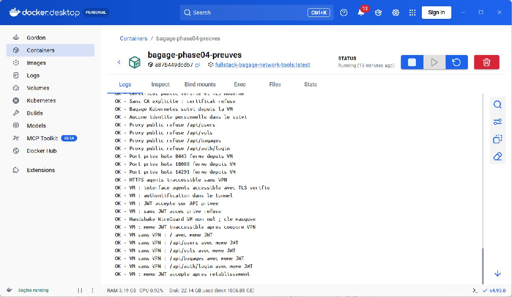
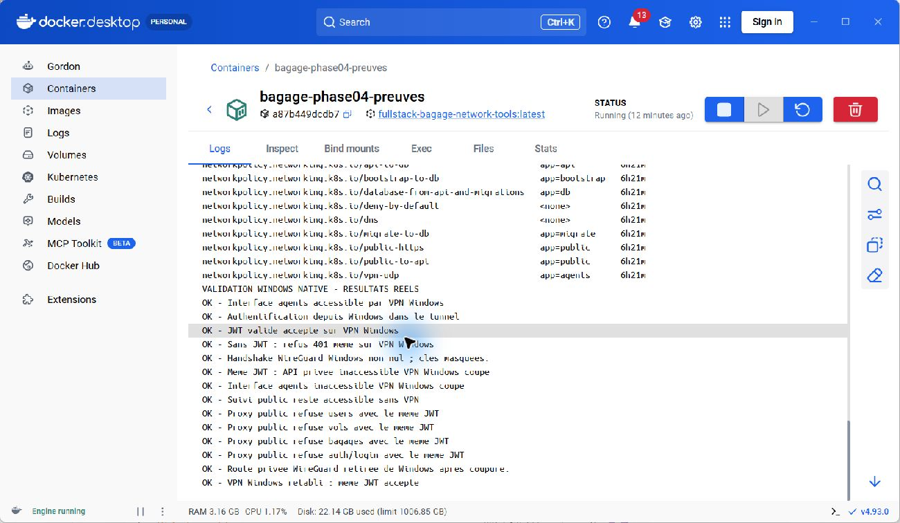

# Complément de phase 4 — Windows natif et VMware

Date : 2 octobre 2026. Projet : `C:\Users\User\Desktop\fullstack-bagage`.

## Validation Windows réalisée

**24 contrôles réussis**, en complément des 59 contrôles Kubernetes : 10 sur HTTPS public, 4 avec VPN actif, 7 après coupure, 1 après rétablissement, 1 handshake WireGuard et 1 disparition de la route privée. Le total est **83 contrôles**, sans compter deux fois les 10 contrôles publics.

Le même JWT permet l’accès privé avec le tunnel, devient inutilisable depuis ce client après coupure et fonctionne après rétablissement. Le site public reste accessible. Les routes privées restent refusées sur le proxy public. Le JWT temporaire a été supprimé et le service a retrouvé son état initial arrêté.

WireGuard a été installé à partir du MSI officiel dont la signature Authenticode WireGuard LLC est valide. La configuration privée est protégée dans `%ProgramData%\BagageLabWireGuard`. Le service `WireGuardTunnel$bagage-kube` est en démarrage manuel ; seul `10.77.0.1/32` passe dans le tunnel.

Le client HTTPS Node.js natif Windows vérifie la chaîne et le nom TLS avec la CA locale explicite. Le magasin de confiance Windows n’a pas été modifié : ces tests ne valident pas automatiquement le navigateur Windows ni la révocation Schannel.

Preuves : `docs/preuves/phase-04-windows-public.json`, `phase-04-windows-vpn.json`, `phase-04-windows-off.json`, `phase-04-windows-restored.json`, `phase-04-windows-handshake.txt` et `phase-04-windows-route.txt`.

## Reproduire

Le cluster bagage doit être prêt. Dans PowerShell administrateur :

```powershell
Set-Location C:\Users\User\Desktop\fullstack-bagage
./scripts/Test-WindowsNative.ps1
```

Le script supprime le JWT temporaire et restitue l’état initial du tunnel dans `finally`. Aucun JWT ni clé privée n’est imprimé. Pour vérifier uniquement HTTPS public sans élévation, ajouter `-PublicOnly`.

## Validation réelle dans VMware

La VM **Ubuntu 64-bit (2)** a exécuté **25 contrôles réussis** : 13 sans VPN et 12 pour le scénario VPN, handshake compris. HTTPS vérifie la chaîne et le nom du certificat ; le suivi public fonctionne et les routes privées sont refusées. Dans Ubuntu, WireGuard permet l’accès agents et l’authentification. Le même JWT devient inutilisable après coupure et fonctionne après rétablissement. Le site public reste accessible sans VPN.

Le réseau privé initial n’avait aucune adresse IP. Sa configuration a été sauvegardée, puis temporairement passée en NAT. Un relais TCP HTTPS et UDP WireGuard a relié la VM au laboratoire loopback Windows, avec règles Windows temporaires limitées au réseau NAT et à l’adresse hôte. Cela valide une vraie VM externe aux pods, avec un relais de laboratoire ; ce n’est pas un accès Internet.

Le profil Windows a été utilisé exclusivement dans la VM pendant que le tunnel Windows était arrêté. WireGuard-tools a été installé dans Ubuntu. Après tests, le tunnel VM, le JWT, les identifiants et le profil temporaire ont été supprimés. Les règles de firewall et le relais Windows ont été retirés. La VM a été arrêtée proprement et son réseau `pvn` d’origine rétabli. WireGuard-tools reste installé.

### Limite découverte sur le poste partagé

Le premier contrôle des ports a échoué : un PostgreSQL Windows écoute sur 5432. Le backend de l’autre projet training_pfe est publié sur 8080. Ces services n’ont pas été modifiés. Le diagnostic initial est conservé dans `phase-04-vmware-diagnostic-ports.*`. Le test final vérifie les ports 8443, 18080 et 14201 fermés ; il **ne valide pas la fermeture globale de 5432 et 8080 sur le poste**. Le déploiement Kubernetes bagage conserve ses services API et PostgreSQL en ClusterIP, sans publication de ces ports.

Preuves : `docs/preuves/phase-04-vmware-sans-vpn.json`, `phase-04-vmware-vpn-vpn.json`, `phase-04-vmware-vpn-off.json`, `phase-04-vmware-vpn-restored.json`, `phase-04-vmware-vpn-handshake.txt`, `phase-04-vmware-nettoyage.txt` et `phase-04-vmware-firewall-nettoyage.json`.



Capture JPEG originale de Docker Desktop affichant les sorties réellement exécutées dans Ubuntu via VMware Tools. Le conteneur est uniquement un lecteur de preuves.

## Paquet de tests préparé

`work/phase-04/vm-validation` contient `probe_vm.py`, le certificat public `ca.crt` et la référence fictive `demo.json`, sans mot de passe, JWT ou clé privée. Source : `infra/kubernetes/probe_vm.py`.

Après accès et configuration réseau, exécuter dans Ubuntu en remplaçant ADRESSE_HOTE par l’adresse réellement vérifiée :

```bash
python3 probe_vm.py --host ADRESSE_HOTE --ca ca.crt --demo demo.json --output validation-vm-sans-vpn.json
```

Le script vérifie l’identité TLS localhost, le suivi, les routes interdites et les ports privés. Le scénario VPN avec le même JWT est archivé dans les preuves VMware ; les scripts de ce scénario sont conservés sans identifiants dans infra/kubernetes.

**Total : 108 contrôles réussis** (59 Kubernetes + 24 Windows + 25 VMware), hors vérifications de nettoyage. Le diagnostic de ports initial reste un échec documenté.

## État

| Validation | Résultat |
|---|---|
| Kubernetes et clients Docker | 59 contrôles réussis |
| Windows natif, HTTPS et VPN avec coupure/rétablissement | 24 contrôles réussis |
| VM VMware réelle | 25 contrôles réussis ; réseau initial rétabli |
| Internet | Non testé ; une VM locale ne constitue pas un test Internet |

## Capture réelle Windows



Capture originale de Docker Desktop affichant les sorties des tests exécutés sur Windows. Ce conteneur sert à consulter les preuves ; il ne constitue pas le client VPN testé.
