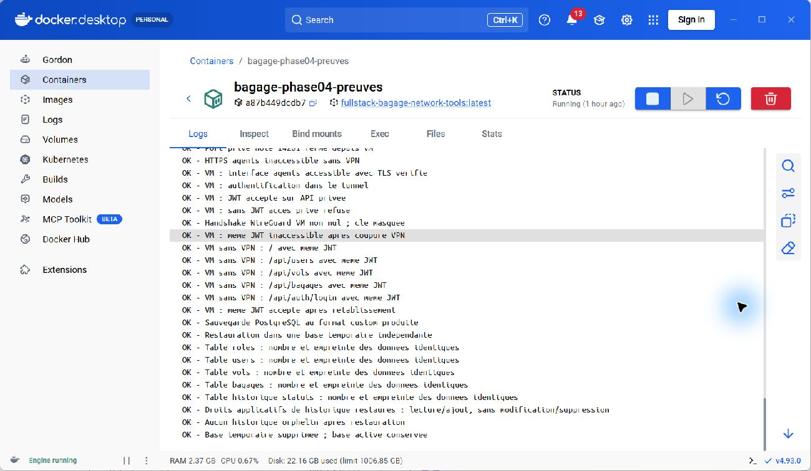
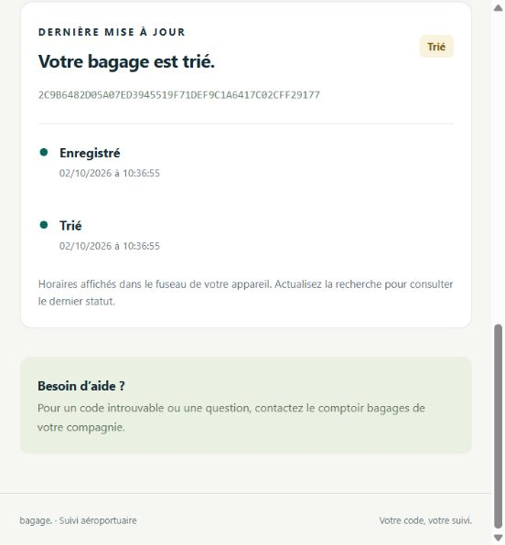

# Phase 4c — Recette finale et clôture de la démonstration

Date : 2 octobre 2026. Répertoire : `C:\Users\User\Desktop\fullstack-bagage`.

## Objectif et niveau atteint

Terminer la recette du projet de démonstration demandé par le cahier des charges. Les phases 0 à 4 sont réalisées et les validations locales, Docker, Kubernetes, Windows et VMware ont abouti. La phase 4 comprend maintenant une sauvegarde restaurée et un vrai accès au suivi par une URL Internet temporaire.

La démonstration est prête pour le rapport et la soutenance, avec les limites ci-dessous. Elle n'est pas une exploitation de production et aucun pourcentage de couverture du code n'est déduit des nombres de contrôles.

## Enchaînement des étapes

| Ordre | Étape | Résultat observé | Preuves |
|---|---|---|---|
| 1 | Cadrage et modèle de données | Réalisés | Guides 00 et 01 |
| 2 | API .NET, JWT, rôles, historique, Docker | 39 fonctionnels, 9 sécurité, 14 Docker, 2 persistance | Phase 01 |
| 3 | Angular public et agents, intégration | 33 HTTP et 21 navigateur | Phase 02 |
| 4 | WireGuard, segmentation, TLS Compose | 40 contrôles | Phase 03 |
| 5 | Kubernetes, NetworkPolicy, scan depuis Docker, PVC | 59 contrôles ; suite rejouée lors de cette recette | Phase 04 |
| 6 | Windows natif et VM VMware | 24 Windows et 25 VMware | Guide 04b |
| 7 | Métier sur le déploiement final | 49 contrôles réussis | recette-metier.json |
| 8 | Sauvegarde et restauration isolée | 10 contrôles réussis | recette-restauration.txt |
| 9 | Durcissement des ressources réellement déployées | 27 contrôles réussis | recette-infrastructure.json |
| 10 | Suivi via URL Internet temporaire | 9 HTTP et 3 navigateur | recette-internet*.json |
| 11 | Journaux d'anomalies et dépendances | 2 observations de logs positives ; 2 audits sans vulnérabilité signalée | recette-journalisation.json, recette-dependances-* |
| 12 | Rapport, captures originales, nettoyage | Dossier mis à jour ; tunnel public temporaire arrêté | AVANCEMENT.md et preuves de nettoyage |

Les suites finales et les compléments de phase 4 regroupent **210 contrôles et observations réussis**, dont les audits de dépendances. Le rejeu des 59 contrôles Kubernetes n'est pas ajouté une seconde fois. Les suites des phases antérieures ne sont pas ajoutées à ce total, car elles recouvrent des comportements déjà examinés.

## Recette métier : résultat concret

Des comptes fictifs de chacun des quatre rôles ont été créés. Le superviseur crée le vol ; l'agent d'enregistrement crée le bagage ; l'agent de tri réalise `enregistre → trie → charge → en_vol → livre`. Les cinq événements contiennent chacun l'agent et la date. Le suivi public montre le statut et les dates sans identité, motif ou identifiant interne.

Le saut d'étape, la répétition de statut et les opérations avec un rôle insuffisant sont refusés. La perte est déclarée depuis enregistré ; une récupération nécessite un superviseur et un motif. L'anomalie est conservée dans l'historique privé et son événement apparaît dans les journaux API. Une signature JWT falsifiée, le verrouillage après cinq échecs et la limitation de débit sont également vérifiés.

Les données fictives restent dans le laboratoire pour permettre la démonstration. Aucun mot de passe ou JWT n'est enregistré dans les preuves partageables.

## Sauvegarde réellement restaurée

`pg_dump -Fc` produit une archive privée dans `work/phase-04/backups/bagage-recette.dump`. Elle est restaurée dans une base temporaire distincte sur PostgreSQL Kubernetes. Pour chacune des tables roles, users, vols, bagages et historique_statuts, le nombre et l'empreinte des lignes sont identiques. Les droits d'ajout sans modification/suppression de l'historique sont vérifiés, ainsi que l'absence d'événements orphelins.

La base temporaire est supprimée et la base active reste intacte. Ce résultat prouve une restauration logique ; il ne simule pas la perte du serveur ni une restauration sur un autre cluster. Les rôles PostgreSQL préexistants et l'infrastructure de stockage restent nécessaires. Ne jamais mettre l'archive contenant les hashes et données dans le rapport public.



Capture JPEG originale de Docker Desktop. Le conteneur de preuves affiche les résultats produits par PostgreSQL ; ce n'est pas une capture HTML ni une base simulée.

## Internet : ce qui a réellement été testé

Un Quick Tunnel Cloudflare sans compte ni domaine a exposé **uniquement** le proxy public `https://localhost:15443`. Son binaire officiel a été vérifié par l'empreinte publiée dans la release GitHub. La connexion vers l'origine utilise la CA locale et le nom localhost ; la vérification TLS n'est pas désactivée. Le navigateur et Node ont atteint l'URL HTTPS Cloudflare, affiché le vrai suivi et vérifié le refus des routes comptes, vols, bagages et connexion.

Le client de test reste sur Windows, mais passe par une URL DNS publique et le service Cloudflare. La tentative de lecture depuis l'outil web distant n'a pas abouti : elle ne compte pas comme un test réussi. Il n'y a **ni scan Internet distant, ni WireGuard depuis Internet**. Ces validations nécessitent un client distant contrôlé et un point d'entrée UDP public. Un tunnel web ne les remplace pas.

Le tunnel temporaire a été arrêté après la capture. L'URL archivée n'est pas une adresse pérenne du projet. Aucun compte cloud, abonnement ou domaine payant n'a été créé.



Manipulation : ouvrir l'URL Cloudflare, saisir le code fictif dans « Code de suivi », cliquer « Suivre mon bagage », puis afficher le résultat. La capture originale montre Trié et les deux événements conservés.

Sources : [Quick Tunnels](https://developers.cloudflare.com/tunnel/get-started/quick-tunnels/), [vérification TLS de l'origine](https://developers.cloudflare.com/tunnel/reference/origin-parameters/).

## Commandes reproductibles

Depuis PowerShell 7, dans le dossier du projet :

```powershell
# Si le cluster n'est pas prêt :
./scripts/Start-Phase04.ps1

# Enchaînement automatique, sans exposer le site sur Internet :
./scripts/Invoke-FinalValidation.ps1

# Même recette avec URL Internet éphémère et arrêt automatique :
./scripts/Invoke-FinalValidation.ps1 -Internet

# Test Windows natif, PowerShell administrateur :
./scripts/Test-WindowsNative.ps1
```

La recette métier attend deux fois trente secondes pour isoler le test de verrouillage du quota des connexions précédentes. La restauration peut être exécutée seule avec `Test-BackupRestore.ps1` ; le durcissement avec `Test-FinalInfrastructure.ps1`.

Pour une nouvelle capture Internet, exécuter `Start-InternetDemo.ps1`, ouvrir l'URL affichée, faire le suivi, puis arrêter avec `Stop-InternetDemo.ps1`. Ne pas laisser le tunnel ouvert après la démonstration. Les tests VMware exigent un accès invité et une configuration réseau vérifiée ; les preuves précédentes sont conservées et ne sont pas recréées artificiellement.

## Limites conservées et suite

- Le PostgreSQL Windows sur 5432 et le backend training_pfe sur 8080 appartiennent à l'environnement partagé. Le diagnostic initial de la VM reste un échec documenté ; la fermeture globale de ces ports n'est pas annoncée. PostgreSQL et l'API du projet bagage restent privés dans Kubernetes.
- Les audits couvrent les paquets NuGet, transitifs compris, et les dépendances npm de production. Ils ne constituent pas un audit de toutes les images ou du système d'exploitation.
- Le cluster est mono-nœud, avec stockage local. Haute disponibilité, sauvegardes hors site planifiées, supervision/alertes continues et audit indépendant restent des objectifs de production.
- La CA du laboratoire n'est pas installée dans le magasin Windows. Les clients locaux la fournissent explicitement ; le certificat de l'URL Internet est celui du service Cloudflare.

**Étape actuelle : phase 4 clôturée pour la démonstration locale/VM et le suivi public par Internet ; préparation de la soutenance.** La validation réseau Internet complète reste conditionnée à une infrastructure distante réelle.
